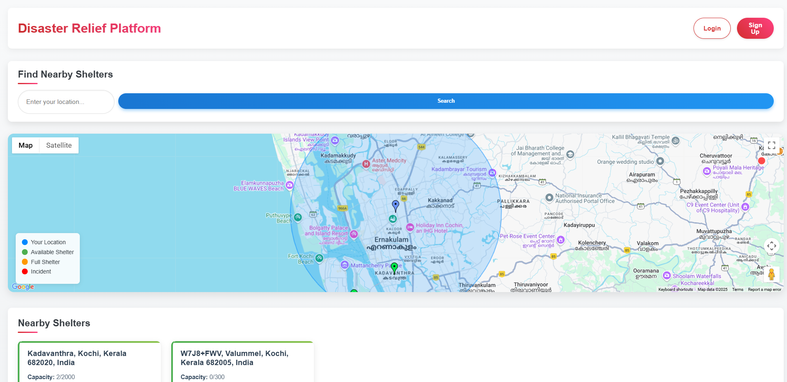
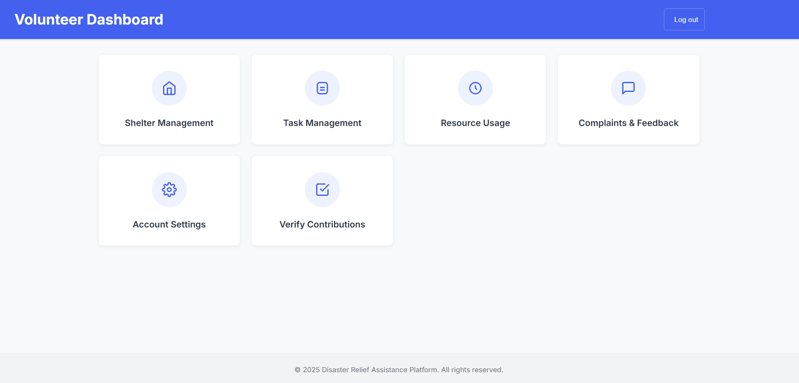
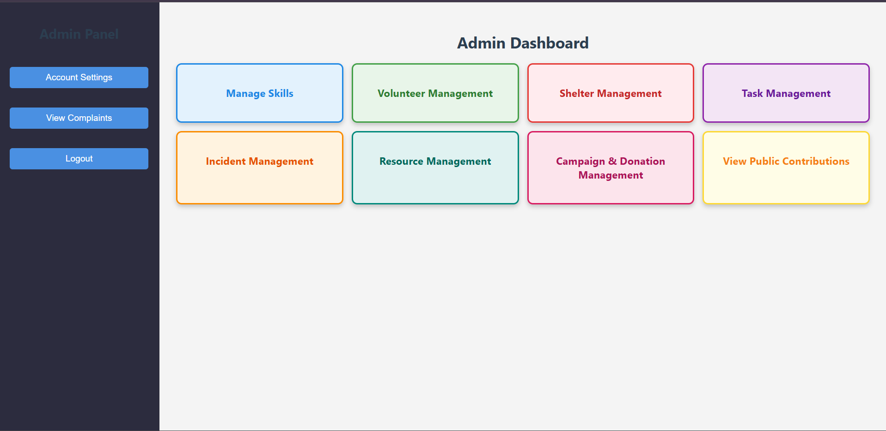
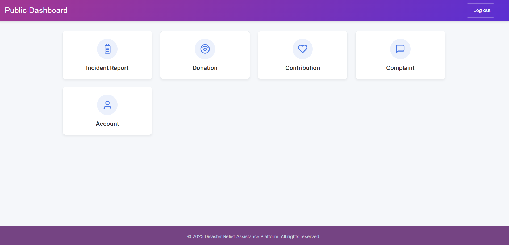
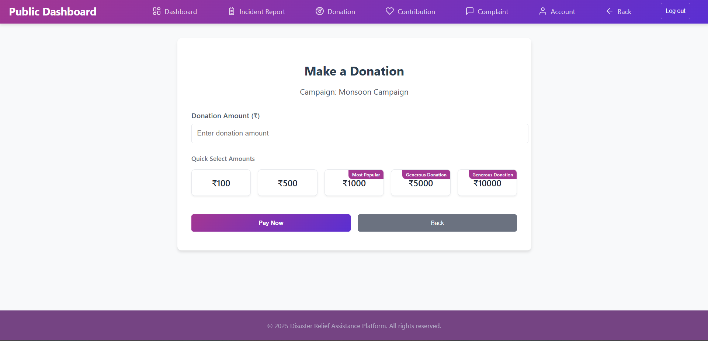
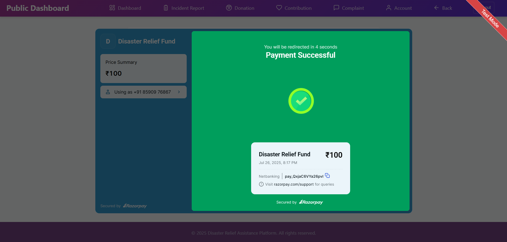

# 🌐 Disaster Relief Assistance Platform (DRAP)

Disaster Relief Assistance Platform is a MERN stack-based web application built to make disaster response and recovery easier and more organized through a centralized system that connects administrators, volunteers, and the public.

---

## 🚀 Features

### 🧑‍💼 Admin

* Register/manage users
* Allocate & monitor resources (food, shelter, medical kits, etc.)
* Assign & track volunteer tasks
* Manage emergency shelters
* Send alerts & notifications
* Manage donations

### 🧑‍🚒 Volunteer

* Register with their skills (rescue, cooking, medical, driving etc..)
* View & accept tasks
* Share real-time updates on task progress and resource usage
* Provide feedback

### 👥 Public

* Register & report disaster incidents
* Donate (supplies or funds)
* View nearby shelters with availability
* Stay informed through alerts

---

## 🧱 Tech Stack

| Layer    | Technology                      |
| -------- | ------------------------------- |
| Frontend | React.js                        |
| Backend  | Node.js, Express.js             |
| Database | MongoDB                         |
| Styling  | CSS, Bootstrap                  |
| Payment  | Razorpay                        |
| Maps     | Google Maps                     |

---
Thanks for the clarification and folder structure screenshot. Based on your actual structure, here's the corrected and simplified **Setup & Installation** section for your `README.md`, aligned with your project layout:

---

## 🔧 Setup & Installation

### ▶️ Clone & Install

```bash
git clone https://github.com/abinjosepullattu/Disaster_Platform.git
cd Disaster_Platform

# Install backend dependencies
cd backend
npm install

# Install frontend dependencies
cd ../frontend
npm install
```

---

### ⚙️ Run the Project

```bash
# Run backend
cd backend
npm start

# Run frontend (in a new terminal)
cd frontend
npm start
```

---

### 📁 Project Structure

```
Disaster_Platform/
│
├── backend/
│   ├── middleware/
│   ├── models/
│   ├── routes/
│   ├── uploads/
│   └── server.js
│
├── frontend/
│   ├── public/
│   ├── src/
│       └── components/
│       └── styles/
│   
│
├── .env
└── package.json
```


---

### 💳 Payment Integration

* Donations from the public are processed securely via Razorpay.

* Admins can track incoming donations via the dashboard.


---

## 📌 Key Modules

* User Management

* Resource Management

* Task Assignment

* Shelter Management

* Incident Reporting

* Alert System

* Manage Donations


---

## 🛡️ Goals & Benefits

* Enhance disaster recovery speed and accuracy

* Centralize coordination between admin, volunteers & public

* Promote transparency and public engagement


---

## 🛠️ Future Enhancements

* AI-based disaster prediction

* IoT-based disaster alerts


## 📸 Screenshots

<table>
  <tr>
    <td align="center">
      <br>
      <sub>Index Page</sub>
    </td>
    <td align="center">
      <br>
      <sub>Volunteer Dashboard</sub>
    </td>
  </tr>
    <tr>
    <td align="center">
      <br>
      <sub>Admin Panel</sub>
    </td>
    <td align="center">
      <br>
      <sub>Public Dashboard</sub>
    </td>
  </tr>
    <tr>
    <td align="center">
      <br>
      <sub>Donation Page</sub>
    </td>
    <td align="center">
      <br>
      <sub>Payment Page</sub>
    </td>
  </tr>
</table>


